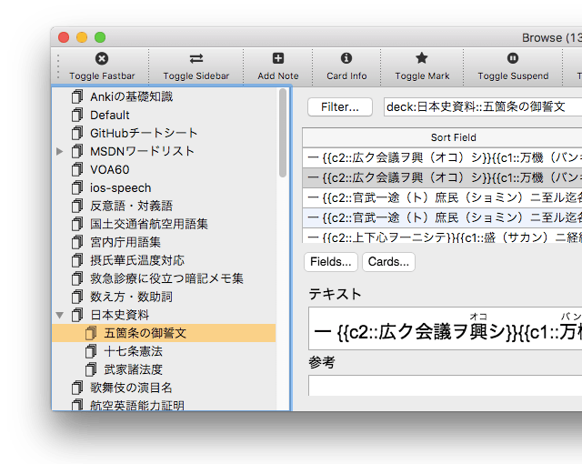
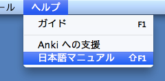

# Anki Add-ons

Simple add-ons add some features to Anki.

## [Another Retreat](https://ankiweb.net/shared/info/1481634779) (Code: 1481634779)
Another Retreat: an Anki addon sets the next interval at lapse to the last succeed interval.

**Note: This add-on also works with Anki 2.1.**

**Model Diagram for Another Retreat**

For more details: [忘れた Anki カードの出直し方](http://rs.luminousspice.com/anki-lapse-management/)

## [Ease Factor Histogram](https://ankiweb.net/shared/info/494944895) (Code: 494944895)
Ease Factor Histogram: an Anki addon appends a histogram of Ease Factor on the stats screen.

**Note: This add-on also works with Anki 2.1.**

For more details: [Ease Factor Histogram 単語帳の健全性を診断するアドオン](http://rs.luminousspice.com/addon-ease-factor-histogram/)

## Feed to Anki [for 2.0](https://ankiweb.net/shared/info/1895937979) (Code: 1895937979), [for 2.1](https://ankiweb.net/shared/info/655089895) (Code: 655089895)
Feed to Anki: an Anki addon makes a RSS (or Atom) Feed into Anki cards.

**Note: This add-on also works with Anki 2.1.**

For more details: [Feed to Anki 毎日英単語のカードを増やせるアドオン](http://rs.luminousspice.com/addon-feed-to-anki-for-wotd/)

## [Backup Key](https://ankiweb.net/shared/info/1790131139) (Code: 1790131139)
Backup Key: an Anki add-on adds a shortcut for saving a backup file from the deck list on the main window.

**Note: This add-on also works with Anki 2.1.**

## [Toggle Bury](https://ankiweb.net/shared/info/1039419543) (Code: 1039419543)
Toggle Bury: an Anki add-on adds a toggle button to bury cards in the Card Browser.

**Note: This add-on only works with Anki 2.0. Another add-on "Fastbar" provides the toggle bury feature for Anki 2.1.**

![Toggle Bury Button on the Card browser (Shortcut [Cmd/Ctrl+-])](toggle_bury.png)

## [Frozen Card](https://ankiweb.net/shared/info/2088021617) (Code: 2088021617)
Frozen Card: an Anki add-on adds a deck option to deactivate Anki algorithm to keep cards new in the decks.

**Note: This add-on also works with Anki 2.1.**

## [Fastbar](https://ankiweb.net/shared/info/1955978390) (Code: 1955978390)
Fastbar: an Anki 2.1 add-on adds a Toolbar and toggle the Sidebar in the Card Browser of Anki 2.1 beta.

**Note: This add-on also works with Anki 2.1 (after Beta 12). This is a  preliminary version because it's possible not to work due to any changes of Anki 2.1 Beta in future.**

## [Japanese Help Launcher](https://ankiweb.net/shared/info/103383488) (Code: 103383488)
Japanese Help Launcher: an Anki addon adds an menu item to launch Anki help document in Japanese.

**Note: This add-on also works with Anki 2.1.**

## [Mature Tag](https://ankiweb.net/shared/info/17741639) (Code: 17741639)
This Add-on automatically adds a tag on your mature notes after the review.

**Note: This add-on also works with Anki 2.1.**

A sample code for the article: [フックを使った Anki アドオンのつくり方](http://rs.luminousspice.com/how_to_create_anki_add-ons/)

## [1min Interval Report](https://ankiweb.net/shared/info/1353526614) (Code: 1353526614)
This Add-on reports totals and ratio of 1min interval in review log for each deck.

**Note: This add-on also works with Anki 2.1.**

For more details: [Anki における新規カード一分間トラップの分析](http://rs.luminousspice.com/1min-trap-in-anki-learning/)

## [Find Mature](https://ankiweb.net/shared/info/339760671) (Code: 339760671)
Find Matures: an Anki addon adds a tag to find mature cards on the left pane of Card Browser.

**Note: This add-on will not work with Anki 2.1 after beta 11.**

